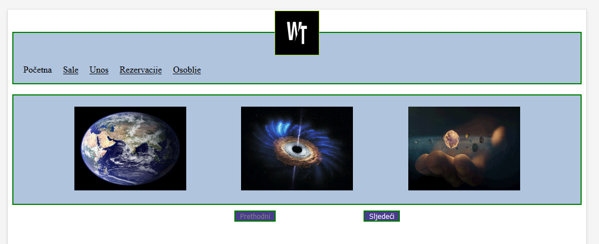
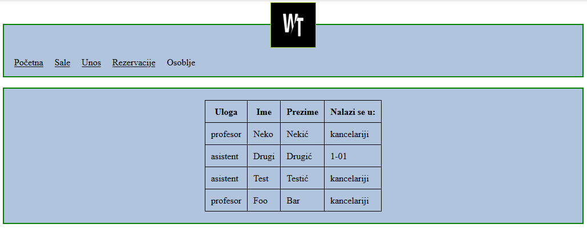
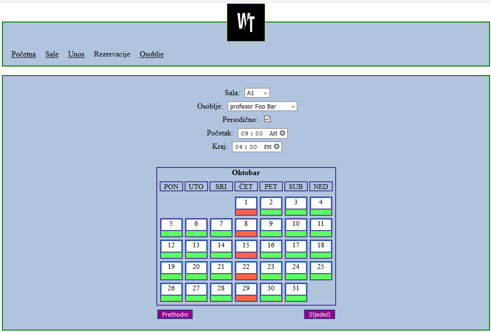
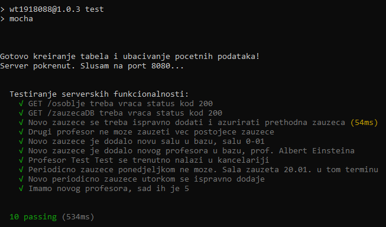

#### Faculty of Electrical Engineering, Sarajevo
#### Web technologies, 2018/2019

---

A simple web application primarly used as an introduction to some fundamental web technologies.  
Written using **HTML5**, **CSS**, **NodeJS**, **Express** and **MySQL**. Tested using **mocha** and **chai**.

1. Download **NodeJS**
2. Download **XAMPP**
3. Configure **MySQL** with `username='root'` and `password=''`.
4. Run `node index.js` command in project root directory.
5. Access the app via `localhost:8080`.

---

 
 
 

